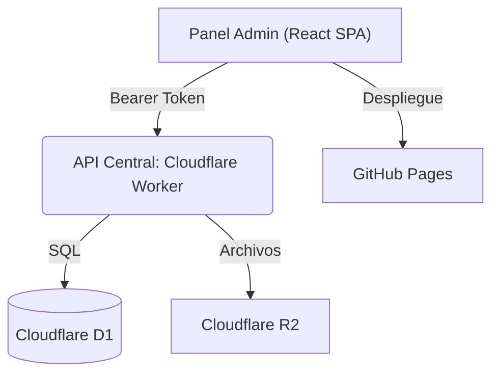

# Encuadre Admin 2026 — Panel de Administración

Panel de control interno para la gestión de registros, pagos y asistencia del **36 FTD · Futurología y Tendencia del Diseño — Encuadre 2026**.

## Resumen ejecutivo

- **SPA en React 19** construida con **Vite**, desplegada automáticamente en **GitHub Pages**.
- **Conexión segura** a la API central (Cloudflare Worker) mediante token Bearer (`ADMIN_SECRET`).
- **Dashboard analítico** con gráficas interactivas (Recharts) de KPIs, pagos, ocupación y tendencias.
- **Gestión de participantes** con búsqueda, filtros, paginación, visualización de comprobantes PDF y aprobación de pagos.
- **Monitoreo de cupos** en tiempo real por taller, con indicadores de disponibilidad.

## Arquitectura



El panel **no se conecta directamente** a la base de datos. Toda la comunicación pasa por la API central del Cloudflare Worker, que es compartida con el sitio público de pre-registro y la app QR.

## Stack tecnológico

| Tecnología       | Versión | Uso                                      |
| ---------------- | ------- | ---------------------------------------- |
| React            | 19.x    | Framework de UI (SPA)                    |
| React Router DOM | 7.x     | Enrutamiento del lado del cliente        |
| Vite             | 8.x     | Bundler y servidor de desarrollo         |
| Recharts         | 3.x     | Gráficas del dashboard                   |
| Lucide React     | 1.x     | Iconografía                              |
| Inter (Fontsource) | 5.x   | Tipografía, autoalojada con la aplicación |
| SheetJS (xlsx)   | 0.18    | Exportación de datos a Excel             |
| ESLint           | 10.x   | Linting de código                        |
| GitHub Actions   | —       | CI/CD automático a GitHub Pages          |

## Mapa del repositorio

```
Encuadre_Admin_2026/
├── .github/workflows/
│   └── deploy.yml            # CI/CD: build + deploy a GitHub Pages
├── public/                   # Recursos estáticos
├── src/
│   ├── assets/               # Imágenes y recursos del proyecto
│   ├── components/
│   │   ├── ErrorBoundary.jsx  # Captura errores de React y muestra fallback
│   │   ├── ExpandableRow.jsx  # Fila expandible de la tabla de participantes
│   │   ├── Sidebar.jsx        # Barra lateral de navegación
│   │   └── Toast.jsx          # Notificaciones flotantes (success/error/info)
│   ├── context/
│   │   └── ToastContext.jsx   # Contexto global para el sistema de toasts
│   ├── hooks/
│   │   └── useRegistros.jsx   # Hook principal: fetch, aprobar pagos, PDF, Excel
│   ├── pages/
│   │   ├── Login.jsx          # Pantalla de autenticación
│   │   ├── Dashboard.jsx      # KPIs y gráficas analíticas
│   │   ├── Participantes.jsx  # Tabla de registros con filtros y paginación
│   │   └── Cupos.jsx          # Vista de disponibilidad por taller
│   ├── App.jsx                # Componente raíz y enrutamiento
│   ├── index.css              # Sistema de diseño: tokens, componentes y responsive
│   └── main.jsx               # Punto de entrada de React
├── .env.example               # Plantilla de variables de entorno
├── vite.config.js             # Configuración de Vite (base path para GH Pages)
├── package.json               # Dependencias y scripts
└── README.md                  # Este archivo
```

## Inicio rápido

### 1) Clonar e instalar

```bash
git clone https://github.com/Encuadre2026/Encuadre_Admin_2026.git
cd Encuadre_Admin_2026
npm install
```

### 2) Variables de entorno

Crear un archivo `.env` en la raíz (ya está en `.gitignore`):

```env
VITE_API_URL=https://encuadre-2026-api.sitio-392.workers.dev
```

### 3) Ejecutar en desarrollo

```bash
npm run dev
```

La aplicación queda disponible en `http://localhost:5173/Encuadre_Admin_2026/`.

### 4) Construir para producción

```bash
npm run build
```

Los archivos estáticos se generan en `dist/`.

## Autenticación

El panel utiliza un sistema de autenticación basado en el secreto administrativo (`ADMIN_SECRET`) configurado en el Cloudflare Worker:

1. El usuario ingresa la contraseña en la pantalla de Login.
2. Se hace una petición de prueba a `GET /api/admin/registros` con el header `Authorization: Bearer <secreto>`.
3. Si la respuesta es exitosa (200), se almacena:
   - Un token codificado en `localStorage` (persiste entre sesiones para detección rápida).
   - El secreto real en `sessionStorage` (se borra al cerrar el navegador por seguridad).
4. Si el token expira o es inválido, el panel redirige automáticamente al Login.

## Páginas

### Dashboard (`/dashboard`)

Vista analítica con 4 KPIs principales y 6 gráficas:

- **KPIs**: Total de registros (y en cuántos talleres), Ocupación global (%),
  Asistencias (y qué porcentaje del total son), Pagos validados. La cifra de
  pagos pendientes lleva a Participantes con el filtro «Pendientes» ya puesto:
  es lo que se hace después de leerla, y eran tres clics.
- **Primero lo operativo**: la curva de inscripciones por día y los talleres
  —Top 5 más solicitados y Top 3 menos—, que son las dos preguntas que se hacen
  al abrir el panel. Debajo, la composición: estatus de pagos, audiencia local
  frente a foránea y distribución de perfiles, en tres donuts.
- **Las barras llevan su cifra escrita**, igual que las leyendas de los donuts:
  estimar la longitud de una barra contra el eje no es leer un dato, y pasar el
  ratón por encima no ocurre nunca en una tableta. Los talleres sin nadie
  inscrito llevan su `0`; recharts no dibuja rectángulo para un valor de cero, y
  sin rectángulo tampoco hay etiqueta, así que el taller vacío desaparecía por
  completo de la gráfica que existe justamente para enseñarlo.
- **Sin datos, cada gráfica lo dice.** Recharts no falla cuando no hay nada que
  dibujar: pinta un lienzo perfectamente vacío, que se ve igual que una gráfica
  rota. Y el primer día del pre-registro, eso es lo que hay.

### Participantes (`/participantes`)

Tabla completa de registros con:

- **Búsqueda** por ID, nombre, correo o institución (con debounce de 300ms). La
  tecla `/` lleva el foco al buscador desde cualquier parte de la página, y `Esc`
  la vacía.
- **Filtros**: por taller, estado de pago (Pendientes/Confirmados), tipo de institución (UAA/Foráneos).
- **Los filtros puestos se ven y se quitan**: una pastilla por cada uno, con su
  aspa, y un «Limpiar filtros». Eran tres controles en tres sitios distintos de
  la barra, y para volver al padrón entero había que acordarse de cuáles se
  habían tocado. El contador de la cabecera dice además de cuántos: «120 de 347».
- **Paginación**: 25, 50, 100 o todas las filas, con navegación numérica. La
  elección se recuerda entre sesiones.
- **Cabecera fija**: se queda a la vista al bajar por el padrón. A partir de la
  fila veinte la tabla era una cuadrícula de valores sin rótulo, y el «Sí» de la
  última columna podía ser asistencia o pago.
- **Filas expandibles**: clic en una fila para ver CURP, teléfono, fecha de registro, etc.
- **Acciones**: ver comprobante PDF (modal con iframe), aprobar pago.
- **Exportar a Excel**: descarga un `.xlsx` con los registros filtrados.
- **Estados vacíos que distinguen**: que no haya nadie inscrito todavía y que
  haya trescientos y los filtros no dejen pasar a ninguno son cosas distintas, y
  solo una de las dos se arregla desde la pantalla. Antes las dos decían «No se
  encontraron registros».

### Cupos por Taller (`/cupos`)

Tarjetas visuales para cada uno de los 21 talleres:

- Barras de progreso separadas para cupos **General** (18 lugares) y **UAA**
  (10 reservados), con la bolsa agotada marcada en rojo.
- Insignias de estado: `Disponible`, `Solo general` (se agotó la reserva UAA),
  `Solo UAA` (se agotó la general), `Casi lleno` (≥80 % sin agotar ninguna) y
  `Lleno`.
- Estadísticas de inscritos frente a capacidad total.

Un cupo son **dos bolsas independientes**, y la insignia lo refleja: antes solo
miraba el total, así que un taller con la reserva UAA agotada y hueco general se
anunciaba en verde como «Disponible» y ningún estudiante de la UAA podía
inscribirse en él.

## Reglas de negocio

| Concepto                   | Valor                  |
| -------------------------- | ---------------------- |
| Cupo máximo por taller     | 18 (público general)   |
| Lugares reservados UAA     | 10 por taller          |
| Capacidad total por taller | 28 (18 + 10)           |
| Total de talleres          | 21                     |

**El panel no decide, muestra.** El reparto entre UAA y general lo calcula la
API con la misma regla que aplica el alta —igualdad con el nombre completo de la
institución—. El panel lo recalculaba por su cuenta con
`institucion.includes('UAA')`: dos definiciones distintas de quién ocupa un lugar
reservado, que solo coincidían porque hoy hay una única institución con «UAA» en
el nombre.

## Endpoints consumidos

| Método | Endpoint                  | Uso                                     |
| ------ | ------------------------- | --------------------------------------- |
| GET    | `/api/admin/registros`    | Registros y cupos                       |
| POST   | `/api/admin/aprobar_pago` | Aprobar el pago de un participante      |
| DELETE | `/api/admin/registro`     | Borrar un registro (envía correo)       |
| GET    | `/api/admin/comprobante`  | Descargar el PDF de un comprobante      |

Todos requieren `Authorization: Bearer <ADMIN_SECRET>`.

### El contrato

Toda respuesta lleva `ok`; los errores llevan además `codigo` —un identificador
estable— y `mensaje` —el texto que se le enseña a la persona—. `src/api/cliente.js`
lo traduce a un `ErrorApi` con esos dos campos, para que el panel pueda decidir
cómo reaccionar sin comparar cadenas en español.

Antes cada llamada hacía `throw new Error('Error al aprobar pago')` y tiraba lo
que había respondido el servidor: el Worker explicaba con precisión qué pasaba
—«este pago ya fue aprobado», «el participante no existe»— y el panel enseñaba
un texto genérico que no ayudaba a decidir qué hacer.

## Despliegue (CI/CD)

El despliegue es **100% automático** mediante GitHub Actions:

1. **En cada pull request** corre `.github/workflows/verificacion.yml`: linter y
   las pruebas de Playwright. Es donde sirve enterarse de que algo falla.
2. **Al empujar a `main`** corre `.github/workflows/deploy.yml`, que repite esas
   comprobaciones como puerta —si fallan, no se despliega—, compila con
   `VITE_API_URL` y publica `dist/` en GitHub Pages.
3. El panel queda en https://encuadre2026.github.io/Encuadre_Admin_2026

Antes el despliegue solo compilaba. El linter llevaba tiempo en rojo —trece
errores, seis de ellos un componente creado dentro del render— sin que nadie se
enterara, porque nada lo ejecutaba.

## Pruebas

```bash
npm test          # Playwright: compila, sirve y mide sobre el panel real
```

No son pruebas de integración: son de **disposición y comportamiento visible**,
que es lo que ni el linter ni `vite build` pueden ver. Cubren, entre otras cosas:

- Que la página no se desplace en horizontal en 390, 820, 1024 y 1440 px. Lo
  hacía en todos los anchos por debajo de ~1150, incluido cualquier portátil, y
  nadie lo notó porque se trabaja en pantalla grande.
- Que ninguna acción de la tabla quede por debajo del objetivo táctil mínimo de
  24 px de WCAG 2.2.
- Que el visor de comprobantes y la confirmación de aprobar aparezcan **dentro**
  de la ventana. Se colocaban respecto a la página, por un `transform` heredado
  de la animación de entrada, y podían quedar cientos de píxeles fuera.
- Que la insignia del cupo distinga las dos bolsas.
- Que la fuente **llegue**, no solo que se pida: un token bien escrito y un
  archivo que no carga se ven exactamente igual en el código.
- Que el texto apagado alcance 4.5:1 sobre las dos superficies.
- Que con el movimiento reducido el contenido aparezca, en vez de quedarse en el
  `opacity: 0` con el que arranca la animación de entrada.
- Que la dirección del panel a secas lleve al dashboard y no a la página 404.
- Que la cabecera de la tabla siga en pantalla al desplazarla, que la elección
  de filas por página sobreviva a una recarga, que los filtros puestos se puedan
  quitar uno a uno y que `/` lleve al buscador sin robarle la tecla a quien está
  escribiendo.

Cada una se verificó mutando el código para comprobar que se pone en rojo: una
prueba que nunca ha fallado no demuestra nada.

> **Nota:** La variable `base` en `vite.config.js` está configurada como `/Encuadre_Admin_2026/` para que los assets se resuelvan correctamente en GitHub Pages.

## Seguridad

- **Sin secretos en el código fuente**: la contraseña nunca se almacena en código; se ingresa en tiempo de ejecución.
- **sessionStorage para el secreto**: se borra automáticamente al cerrar la pestaña/navegador.
- **Validación server-side**: toda operación sensible (aprobar pagos, ver PDFs) se valida en el Worker con `timingSafeEqual`.
- **ErrorBoundary**: captura errores de React para evitar pantallas en blanco.
- **CORS**: la API solo acepta peticiones desde dominios autorizados.

## Sistema de diseño

Todo lo que decide el aspecto del panel vive en el bloque `:root` de
`src/index.css`: color, tipografía, espaciado, radios, elevación, duraciones y
capas. Fuera de ahí se usa `var(--…)`.

| Escala | Tokens |
| ------ | ------ |
| Color | `--color-bg-*`, `--color-text-*`, los cinco de marca y sus `-dim` |
| Tipografía | `--texto-xs` … `--texto-3xl` (11 → 28 px) |
| Espaciado | `--espacio-1` … `--espacio-7` (4 → 48 px) |
| Radios | `--radio-sm/md/lg/pill` |
| Elevación | `--sombra-1/2/3` |
| Movimiento | `--transicion-rapida/normal` y `--curva` |
| Capas | `--z-boton-flotante`, `--z-velo-lateral`, `--z-sidebar`, `--z-visor`, `--z-confirmacion`, `--z-avisos` |

Antes solo el color estaba centralizado. Lo demás se elegía en cada regla:
**ocho** tamaños de letra distintos (0.65, 0.7, 0.72, 0.75, 0.8, 0.85, 0.875,
0.9 rem), seis radios y seis z-index sueltos. Ninguno estaba mal por separado;
lo que no había era relación entre ellos, y eso es justo lo que se ve.

### Tipografía

La fuente es **Inter**, autoalojada con `@fontsource-variable/inter` e importada
en `src/main.jsx`. El token `--font-family` la pedía desde el primer día y nadie
la cargaba: el panel se veía con Segoe UI en Windows y con San Francisco en un
Mac. Se autoaloja en vez de pedirla a Google para no depender de un tercero en
cada carga; el navegador se descarga solo el recorte Unicode que necesita.

Las cifras que se comparan entre sí —KPIs, cupos, paginación, IDs— llevan
`tabular-nums`, para que un `1` mida lo mismo que un `8` y las columnas de
números no queden dentadas.

### Color

Los colores del panel viven **solo** en los tokens de `:root`. El JSX los usa
como `var(--color-…)`, incluidas las gráficas: recharts pasa el relleno tal cual
al SVG y `fill` resuelve `var()`.

`npm run revisar:color` falla si aparece un hex escrito a mano fuera de los
tokens —**en el JSX y en el CSS**— y corre en las dos puertas de CI. Un linter no
puede atrapar esto: `color: '#2ECC71'` es JavaScript perfectamente válido.
Llegaron a estar los mismos cinco colores escritos treinta y una veces, en
mayúsculas en el JSX y en minúsculas en los tokens.

El script nació mirando solo el JavaScript, y con eso cerró la mitad del
agujero: en el propio `index.css` seguían un `#2ECC71` en la insignia de cupo,
un `#3498DB` en el aviso informativo y un `#9B59B6` en el icono del KPI de pagos
que ni siquiera era el morado de las gráficas. Dos morados distintos a dos
pantallas de distancia, sin que nadie lo hubiera decidido.

Se permiten el negro y el blanco puros: no son colores de marca, se usan como
contraste sobre una superficie ya coloreada. Y los comentarios del CSS quedan
fuera de la revisión, porque con un color no se pinta nada desde un comentario y
estas notas necesitan poder decir qué valor sustituyó a cuál.

### Contraste y movimiento

`--color-text-muted` era `#666666`: 3.4:1, por debajo del 4.5:1 que pide WCAG
para texto pequeño, y con él estaban escritos los rótulos de la fila desplegada,
los de cada gráfica y la marca de «Actualizado hace un minuto». La rampa nueva
lo deja por encima del mínimo sobre las dos superficies, y hay una prueba que lo
mide para que no vuelva a caer.

Con `prefers-reduced-motion: reduce`, las animaciones se anulan. Solo sobrevive
el giro del indicador de carga: es el que dice que algo está ocurriendo.

## Enlaces de producción

- **Panel Admin**: https://encuadre2026.github.io/Encuadre_Admin_2026
- **API Backend**: https://encuadre-2026-api.sitio-392.workers.dev
- **Sitio Principal**: https://futurologiaencuadre-2026.com
- **App QR**: https://encuadre2026.github.io/app-qr
