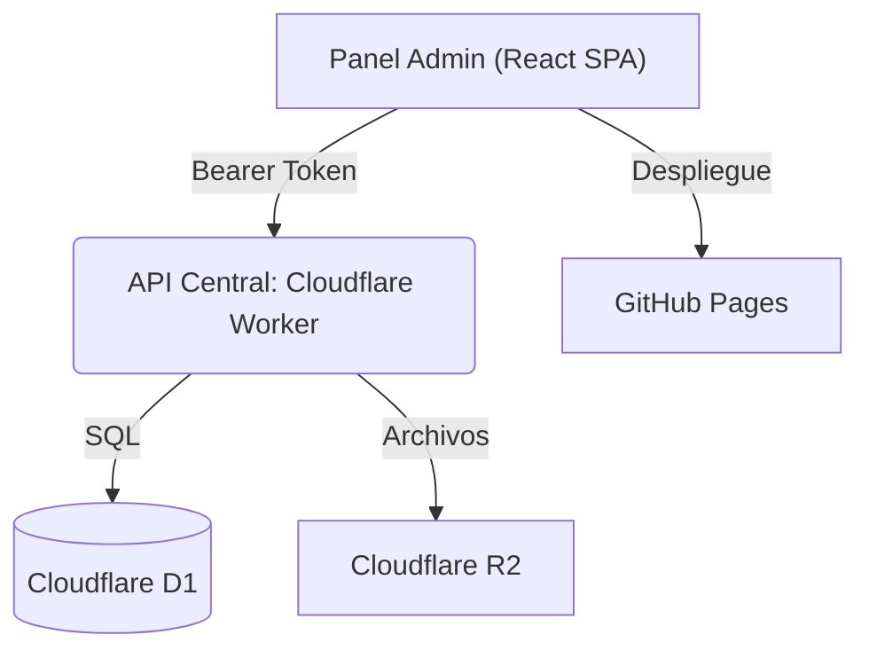

# Encuadre Admin 2026 — Panel de Administración

Panel de control interno para la gestión de registros, pagos y asistencia del **36 FTD · Futurología y Tendencia del Diseño — Encuadre 2026**.

## Resumen ejecutivo

- **SPA en React 19** construida con **Vite**, desplegada automáticamente en **GitHub Pages**.
- **Conexión segura** a la API central (Cloudflare Worker) mediante token Bearer (`ADMIN_SECRET`).
- **Dashboard analítico** con gráficas interactivas (Recharts) de KPIs, pagos, ocupación y tendencias.
- **Gestión de participantes** con búsqueda, filtros, paginación, visualización de comprobantes PDF y aprobación de pagos.
- **Monitoreo de cupos** en tiempo real por taller, con indicadores de disponibilidad.

## Arquitectura



El panel **no se conecta directamente** a la base de datos. Toda la comunicación pasa por la API central del Cloudflare Worker, que es compartida con el sitio público de pre-registro y la app QR.

## Stack tecnológico

| Tecnología       | Versión | Uso                                      |
| ---------------- | ------- | ---------------------------------------- |
| React            | 19.x    | Framework de UI (SPA)                    |
| React Router DOM | 7.x     | Enrutamiento del lado del cliente        |
| Vite             | 8.x     | Bundler y servidor de desarrollo         |
| Recharts         | 3.x     | Gráficas del dashboard                   |
| Lucide React     | 1.x     | Iconografía                              |
| SheetJS (xlsx)   | 0.18    | Exportación de datos a Excel             |
| ESLint           | 10.x   | Linting de código                        |
| GitHub Actions   | —       | CI/CD automático a GitHub Pages          |

## Mapa del repositorio

```
Encuadre_Admin_2026/
├── .github/workflows/
│   └── deploy.yml            # CI/CD: build + deploy a GitHub Pages
├── public/                   # Recursos estáticos
├── src/
│   ├── assets/               # Imágenes y recursos del proyecto
│   ├── components/
│   │   ├── ErrorBoundary.jsx  # Captura errores de React y muestra fallback
│   │   ├── ExpandableRow.jsx  # Fila expandible de la tabla de participantes
│   │   ├── Sidebar.jsx        # Barra lateral de navegación
│   │   └── Toast.jsx          # Notificaciones flotantes (success/error/info)
│   ├── context/
│   │   └── ToastContext.jsx   # Contexto global para el sistema de toasts
│   ├── hooks/
│   │   └── useRegistros.jsx   # Hook principal: fetch, aprobar pagos, PDF, Excel
│   ├── pages/
│   │   ├── Login.jsx          # Pantalla de autenticación
│   │   ├── Dashboard.jsx      # KPIs y gráficas analíticas
│   │   ├── Participantes.jsx  # Tabla de registros con filtros y paginación
│   │   └── Cupos.jsx          # Vista de disponibilidad por taller
│   ├── constants.js           # Constantes del proyecto (ej. cupos UAA)
│   ├── App.jsx                # Componente raíz y enrutamiento
│   ├── App.css                # Estilos específicos del App
│   ├── index.css              # Sistema de diseño global (dark theme)
│   └── main.jsx               # Punto de entrada de React
├── .env.example               # Plantilla de variables de entorno
├── vite.config.js             # Configuración de Vite (base path para GH Pages)
├── package.json               # Dependencias y scripts
└── README.md                  # Este archivo
```

## Inicio rápido

### 1) Clonar e instalar

```bash
git clone https://github.com/Encuadre2026/Encuadre_Admin_2026.git
cd Encuadre_Admin_2026
npm install
```

### 2) Variables de entorno

Crear un archivo `.env` en la raíz (ya está en `.gitignore`):

```env
VITE_API_URL=https://encuadre-2026-api.sitio-392.workers.dev
```

### 3) Ejecutar en desarrollo

```bash
npm run dev
```

La aplicación queda disponible en `http://localhost:5173/Encuadre_Admin_2026/`.

### 4) Construir para producción

```bash
npm run build
```

Los archivos estáticos se generan en `dist/`.

## Autenticación

El panel utiliza un sistema de autenticación basado en el secreto administrativo (`ADMIN_SECRET`) configurado en el Cloudflare Worker:

1. El usuario ingresa la contraseña en la pantalla de Login.
2. Se hace una petición de prueba a `GET /api/admin/registros` con el header `Authorization: Bearer <secreto>`.
3. Si la respuesta es exitosa (200), se almacena:
   - Un token codificado en `localStorage` (persiste entre sesiones para detección rápida).
   - El secreto real en `sessionStorage` (se borra al cerrar el navegador por seguridad).
4. Si el token expira o es inválido, el panel redirige automáticamente al Login.

## Páginas

### Dashboard (`/dashboard`)

Vista analítica con 4 KPIs principales y 6 gráficas:

- **KPIs**: Total de registros, Ocupación global (%), Asistencias, Pagos validados.
- **Gráficas**: Estatus de pagos (pie), Audiencia local vs foránea (pie), Distribución de perfiles (pie), Curva de inscripciones por día (línea), Top 5 talleres más solicitados (barras), Top 3 menos solicitados (barras).

### Participantes (`/participantes`)

Tabla completa de registros con:

- **Búsqueda** por ID, nombre, correo o institución (con debounce de 300ms).
- **Filtros**: por taller, estado de pago (Pendientes/Confirmados), tipo de institución (UAA/Foráneos).
- **Paginación**: 25 registros por página con navegación numérica.
- **Filas expandibles**: clic en una fila para ver CURP, teléfono, fecha de registro, etc.
- **Acciones**: ver comprobante PDF (modal con iframe), aprobar pago.
- **Exportar a Excel**: descarga un `.xlsx` con los registros filtrados.

### Cupos por Taller (`/cupos`)

Tarjetas visuales para cada uno de los 21 talleres:

- Barras de progreso separadas para cupos **General** (18 lugares) y **UAA** (7 reservados).
- Badges de estado: `Disponible`, `Casi lleno` (≥80%), `Lleno`.
- Estadísticas de inscritos vs capacidad total.

## Reglas de negocio

| Concepto                   | Valor                  |
| -------------------------- | ---------------------- |
| Cupo máximo por taller     | 18 (público general)   |
| Lugares reservados UAA     | 7 por taller           |
| Capacidad total por taller | 25 (18 + 7)            |
| Total de talleres          | 21                     |

## Endpoints consumidos

| Método | Endpoint                    | Uso                               |
| ------ | --------------------------- | --------------------------------- |
| GET    | `/api/admin/registros`      | Obtener todos los registros y cupos |
| POST   | `/api/admin/aprobar_pago`   | Aprobar pago de un participante    |
| GET    | `/api/admin/comprobante`    | Descargar PDF de comprobante       |

Todos los endpoints requieren el header `Authorization: Bearer <ADMIN_SECRET>`.

## Despliegue (CI/CD)

El despliegue es **100% automático** mediante GitHub Actions:

1. Al hacer `push` a la rama `main`, se dispara el workflow `.github/workflows/deploy.yml`.
2. El workflow instala dependencias, ejecuta `npm run build` con la variable `VITE_API_URL`, y despliega el contenido de `dist/` a GitHub Pages.
3. El panel queda disponible en: https://encuadre2026.github.io/Encuadre_Admin_2026

> **Nota:** La variable `base` en `vite.config.js` está configurada como `/Encuadre_Admin_2026/` para que los assets se resuelvan correctamente en GitHub Pages.

## Seguridad

- **Sin secretos en el código fuente**: la contraseña nunca se almacena en código; se ingresa en tiempo de ejecución.
- **sessionStorage para el secreto**: se borra automáticamente al cerrar la pestaña/navegador.
- **Validación server-side**: toda operación sensible (aprobar pagos, ver PDFs) se valida en el Worker con `timingSafeEqual`.
- **ErrorBoundary**: captura errores de React para evitar pantallas en blanco.
- **CORS**: la API solo acepta peticiones desde dominios autorizados.

## Enlaces de producción

- **Panel Admin**: https://encuadre2026.github.io/Encuadre_Admin_2026
- **API Backend**: https://encuadre-2026-api.sitio-392.workers.dev
- **Sitio Principal**: https://futurologiaencuadre-2026.com
- **App QR**: https://encuadre2026.github.io/app-qr
